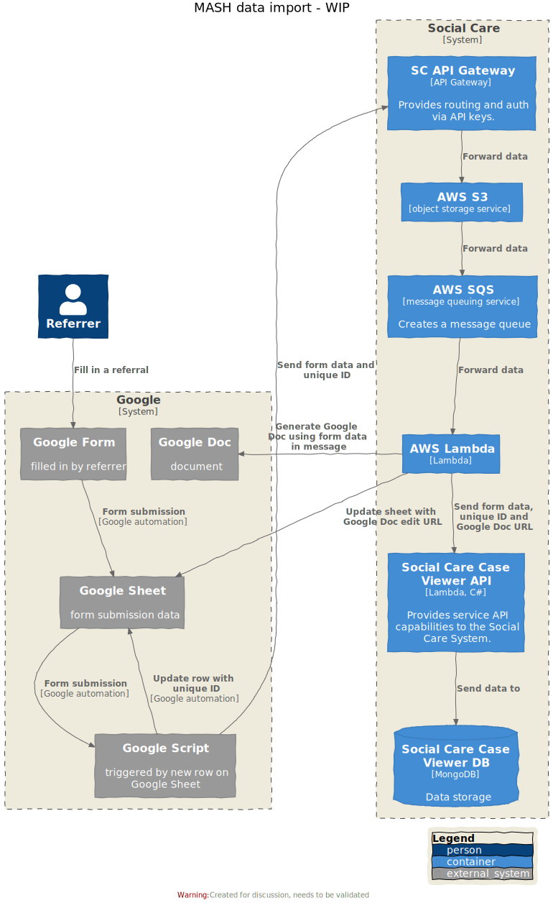
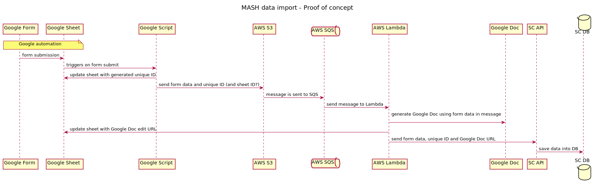

# Social Care Referral Form Ingestion Process

This project processes the data submitted via the MASH (Multi agency Safeguarding Hub) Referrals Google form and enters the data into the Social Care System.



## Table of Contents

- [Social Care Referral Form Ingestion Process](#social-care-referral-form-ingestion-process)
  - [Table of Contents](#table-of-contents)
  - [Documentation](#documentation)
    - [Architecture](#architecture)
      - [Google Side of Things](#google-side-of-things)
      - [AWS Side of Things](#aws-side-of-things)
    - [Brainstorming the new process design](#brainstorming-the-new-process-design)
    - [Google Authentication](#google-authentication)
  - [Deployments](#deployments)
    - [Deploying terraform managed AWS resources](#deploying-terraform-managed-aws-resources)
    - [MASH Terraform Module](#mash-terraform-module)
    - [Deploying to AWS StagingAPIs (Lambda & MASH module)](#deploying-to-aws-stagingapis-lambda--mash-module)
    - [Deploying to AWS Mosaic-Production](#deploying-to-aws-mosaic-production)
      - [Lambda changes](#lambda-changes)
      - [Terraform changes i.e MASH module](#terraform-changes-ie-mash-module)
    - [Environment Variables](#environment-variables)
    - [How to configure CircleCI for automated deployment of our appscript](#how-to-configure-circleci-for-automated-deployment-of-our-appscript)
  - [Testing](#testing)
    - [Manually testing end-to-end](#manually-testing-end-to-end)
  - [Troubleshooting](#troubleshooting)
    - [Clasp push suddenly stops working](#clasp-push-suddenly-stops-working)
  - [Related repositories](#related-repositories)
  - [Active contributors](#active-contributors)
  - [License](#license)

## Documentation

### Architecture

There are two main ecosystems involved in this ingestion process - Google & AWS.

#### Google Side of Things

Once the form data is submitted, it appears in a Google Sheet.
Apps script code is triggered by the submission which then:

- Generates a unique Id for the form data
- Updates the row for that specific submission to include this unique Id
- Sends the form data and its ID to AWS where the data will be further processed.

The Google Apps script code makes an HTTP PUT request to add an object containing the form data to the `form-submissions` folder in our S3 bucket.

#### AWS Side of Things

Once the object is successfully created in S3, the S3 bucket creates an event notification and pushes it to a main queue in SQS.
When a message enters the main queue, it would trigger a lambda function.
The lambda function would:

- receive information about the event and use it to retrieve the form data object in S3.
- use the form data to generate a Google Document which would be saved in a restricted drive.
- update the row in the Google Sheet specific to that form data to include an edit URL of the generated Google Document.

Once the MASH Google Sheet has been updated, the form data, its ID and its Google Doc URL will be saved in a database in the Social Care System.

### Brainstorming the new process design

This goal of this project is to replace the existing process which is quite brittle with a more robust one while incoporating the workflow into the Social Care System.

The [initial MASH handover board](https://miro.com/app/board/o9J_l-7l2BU=/) describes the current process steps, suggestions of UI and ways we could automate the process within the System.



### Google Authentication

The lambda which creates a new google doc and inserts it into the spreadsheet requires authentication. The steps required to set up this authentication are:

1. Find out who is the most sensible person within Hackney to create a [Google Cloud project](https://console.cloud.google.com/projectselector2/iam-admin/serviceaccount)
2. Once the project has been created, a service account must be created within the project
3. After the service account has been created, you must retrieve its credentials which can be downloaded on the service account management page
4. The important properties from the service account credentials are: `client_email` & `private_key`. The credentials must be retrieved from the person who created the service account and should be stored safely in AWS secrets manager
5. The service account requires the following API access added from the Google cloud console: Drive, Spreadsheets, Documents
6. The service account email must also be added as an editor to the desired spreadsheet

## Deployments

We have two environments:

- Staging (i.e. StagingAPIs AWS account)
- Production (i.e. Mosaic-Production AWS account)

### Deploying terraform managed AWS resources

There are two repos relevant for deploying our AWS resources:

1. This [repo](https://github.com/LBHackney-IT/social-care-referral-form-ingestion) contains the [files and setup](terraform) responsible for deploying to _Staging_.
2. The [infrastructure repo](https://github.com/LBHackney-IT/infrastructure/tree/master/projects/mosaic) contains the files and setup responsible for deploying to _Production_.

### MASH Terraform Module

The _Staging_ Social Care System lives in the `StagingAPIs` AWS account while the _Production_ Social Care System lives in the `Mosaic-Production` AWS account.

The MASH referrals process will integrate with the Social Care System and why we need to deploy the MASH AWS infrastructure to these AWS accounts.

To allow us to have a single source of truth of how our terraform-managed AWS resources are defined, we have created a [MASH module](terraform/modules/api-proxy-s3-sqs).

The idea is:

- we import the module into the repo responsible for deploying it to our desired AWS environment.
- we would only need to manage one set of files rather than duplicates across repos.

The MASH module encapsulates the terraform definitions for creating:

- secrets manager resources to hold our Google credentials.
- S3 bucket with an API proxy
- SQS
- S3 bucket event notifications

### Deploying to AWS StagingAPIs (Lambda & MASH module)

Any desired changes to our [lambda code](referral-form-data-process) or the MASH terraform module need to be merged into the `main` branch first.

The CI pipeline only deploys changes on the `main` branch to staging. It will not trigger the job on any other branch.

We use CircleCI to handle deployment jobs; see [CircleCI config](.circleci/config.yml).

### Deploying to AWS Mosaic-Production

#### Lambda changes

Any desired changes to our [lambda code](referral-form-data-process) needs to be merged into the `main` branch first. This will trigger the jobs that deploy to staging first.

If the staging build jobs succeed, the `permit-lambda-deploy-mosaic-prod` job needs to be approved before the pipeline deploys the lambda code to production.

> ⚠️ Note! Only the lambda is deployed to production, not the MASH module. See below.

#### Terraform changes i.e MASH module

For deploying our terraform managed AWS resources, we import the MASH module into the infrastructure repo.
Due to the terraform linter settings on the infrastructure project, we can't import a terraform resource that is not pinned; see [here](https://github.com/terraform-linters/tflint/blob/master/docs/rules/terraform_module_pinned_source.md) for the tflint documentation.

Therefore, the pinned version of the MASH module that we import is `v1.1.0`.

To make any changes to the current social care referral production infrastructure, add/edit/remove the files responsible within the [infrastructure repo](https://github.com/LBHackney-IT/infrastructure/tree/master/projects/mosaic).

> ⚠️ Note! The version of the MASH module imported is pinned at `v1.1.0`. Any changes to the MASH module would require creating a new release tag in this repo and updating the ref value in the source URL in the infrastructure repo.

### Environment Variables

1. The following environment variables are saved as secrets in AWS:

```text
  CLIENT_EMAIL -- the email associated with the Google Service account
  PRIVATE_KEY -- the private key of the Google Service account
  SPREADSHEET_ID -- the id of the google spreadsheet that we update
  TEMPLATE_DOCUMENT_ID -- the id of google doc we use as a template for creating new documents
  ENDPOINT_API -- endpoint url for the service API
  AWS_KEY -- API key to allow the lambda to call the service API
```

2. The following environment variables are saved in the Circle CI project settings:

```text
  CLASP_REFRESH_TOKEN -- the refresh token to authenticate Clasp with Google
  URL_COLUMN -- column that contains the URLs to created google documents
  TITLE -- the title of the google document
```

### How to configure CircleCI for automated deployment of our appscript

1. In your browser go to the google sheet we are looking to deploy our app script against
2. In the sheet click tools -> script editor
3. In the script editor view go to settings (click cog icon)
4. Copy the Script ID value
5. Go to google-scripts/clasp.json and update the value associated with scriptId with what you just copied

## Testing

### Manually testing end-to-end

Due to the interaction between Google services such as Google Forms, Docs and Sheets and our main application, it is important to test the full workflow for the MASH functionality manually. This involves filling out the Google Form and viewing the form response and generated Google Doc within the spreadsheet.

A staging version of the Google Form, Document template, Sheet and Apps script (In-Progress) has been created to allow the ability to test the Google related services manually. The Google Form, Document Template and Sheet are held on the shared Google Drive for the Social Care project and has its own folder called _Referrals-MASH Workflow_. If you do not have access to this Drive you can contact one of the content managers of the Drive for access.

(WIP: Add section related to Apps Script once the staging version has been created)

## Troubleshooting

### Clasp push suddenly stops working

In case of needing to configure our CircleCi credentials again (if clasp push suddenly stops working consider this)

1. Install clasp globally on your system `npm i -g @google/clasp`
2. In your terminal type `clasp login`, your browser should open prompting you to login to a google account, login, you can close the browser once you have logged in
3. locally on your system in your root directory should now exist a file called `.clasprc.json`, output the values to your terminal by typing `cat ~/.clasprc.json`
4. In your terminal you should now see the contents of a JSON file, there should be a key called "refresh_token", we want to copy the value associated with the "refresh_token" key (not including the double quotes)
5. With the refresh_token go to [CircleCI referral form ingestion environment variables](https://app.circleci.com/settings/project/github/LBHackney-IT/social-care-referral-form-ingestion/environment-variables?return-to=https%3A%2F%2Fapp.circleci.com%2Fpipelines%2Fgithub%2FLBHackney-IT%2Fsocial-care-referral-form-ingestion) and remove the existing environment variable "CLASP_REFRESH_TOKEN"
6. Now click to add a new environment variable, call it "CLASP_REFRESH_TOKEN" and give it the value of the refresh_token that you copied from your local ~/.clasprc.json file

## Related repositories

| Name                                                                                         | Purpose                                                                                                                                                                                                                                                                                                     |
| -------------------------------------------------------------------------------------------- | ----------------------------------------------------------------------------------------------------------------------------------------------------------------------------------------------------------------------------------------------------------------------------------------------------------- |
| [LBH Social Care Frontend](https://github.com/LBHackney-IT/lbh-social-care-frontend)         | Provides the UI/UX of the Social Care System.                                                                                                                                                                                                                                                               |
| [Social Care Case Viewer API](https://github.com/LBHackney-IT/social-care-case-viewer-api)   | Provides [service API](http://playbook.hackney.gov.uk/API-Playbook/platform_api_vs_service_api#a-service-apis) capabilities to the Social Care System.                                                                                                                                                      |
| [Infrastructure](https://github.com/LBHackney-IT/infrastructure/tree/master/projects/mosaic) | Provides a single place for AWS infrastructure defined using [Terraform](https://www.terraform.io) as [infrastructure as code](https://en.wikipedia.org/wiki/Infrastructure_as_code) as part of Hackney's new AWS account strategy. The S3 bucket (with API gateway) & SQS resources are deployed from here |
| [API Playbook](http://playbook.hackney.gov.uk/API-Playbook/)                                 | Provides guidance to the standards of APIs within Hackney.                                                                                                                                                                                                                                                  |

## Active contributors

- **Marta Pederiva**, Junior Developer at Hackney (marta.pederiva@hackney.gov.uk)
- **Miles Alford**, Software Developer Apprentice at Hackney (miles.alford@hackney.gov.uk)
- **John Farrell**, Senior Software Engineer at Made Tech (john.farrell@hackney.gov.uk)
- **Renny Fadoju**, Software Engineer at Made Tech (renny.fadoju@hackney.gov.uk)

## License

[MIT License](LICENSE)
